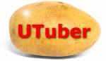

A sample application built around the Youtube API with React. This application was written as a part of the course [Modern React with Redux](https://www.udemy.com/react-redux/).

To run the application:

```
> npm install
> npm start
```
