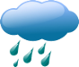

## WeatherWatcher


A sample application built to fetch weather data with React and Redux. This application was written as a part of the course [Modern React with Redux](https://www.udemy.com/react-redux/).

To run the application:

```
> npm install
> npm start
```
